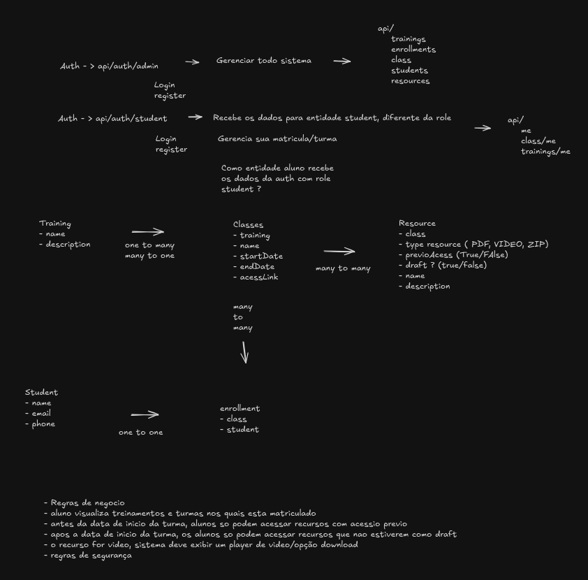

# Classroom Management

Sistema de gerenciamento de sala de aula com autenticação JWT, desenvolvido com Spring Boot e React.



## Tecnologias

### Backend
- **Java 21**
- **Spring Boot 4.0.1**
- **Spring Security** (autenticação JWT)
- **Spring Data JPA**
- **PostgreSQL**
- **Flyway** (migrações de banco de dados)
- **Lombok**
- **Maven**

### Frontend
- **React 19**
- **TypeScript**
- **Vite 7**
- **TanStack Router** (roteamento)
- **TanStack Query** (gerenciamento de estado servidor)
- **TanStack Form** (formulários)
- **Tailwind CSS 4**
- **Radix UI** (componentes acessíveis)
- **Zod** (validação)
- **Axios** (cliente HTTP)
- **Biome** (linting e formatação)
- **Vitest** (testes)

---

## Executar com Docker (Recomendado)

A forma mais simples de executar a aplicação completa:

```bash
docker compose up --build
```

Acesse:
- **Frontend:** http://localhost:3000
- **Backend API:** http://localhost:8080

Para parar:
```bash
docker compose down
```

---

## Executar Localmente (Desenvolvimento)

### Pré-requisitos

- **Java 21+**
- **Maven**
- **Bun** (runtime JavaScript)
- **Docker** (para PostgreSQL)

**Instalação do Bun:**

- Linux/macOS:
  ```bash
  curl -fsSL https://bun.sh/install | bash
  ```
- Windows:
  ```powershell
  powershell -c "irm bun.sh/install.ps1 | iex"
  ```

---

### Terminal 1: Backend (Spring Boot API)

1. **Navegue até a pasta do backend:**
   ```bash
   cd spring-api
   ```

2. **Inicie o banco de dados (Docker Compose):**
   ```bash
   docker compose up -d
   ```

3. **Execute a aplicação:**
   ```bash
   ./mvnw spring-boot:run
   ```

   O backend estará rodando em: `http://localhost:8080`

---

### Terminal 2: Frontend (React)

1. **Navegue até a pasta do frontend:**
   ```bash
   cd front-end
   ```

2. **Instale as dependências:**
   ```bash
   bun install
   ```

3. **Inicie o servidor de desenvolvimento:**
   ```bash
   bun dev
   ```

   Acesse a aplicação em: `http://localhost:3000`
